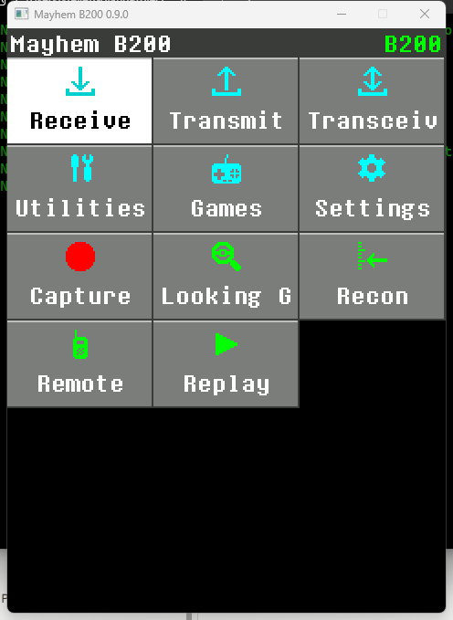
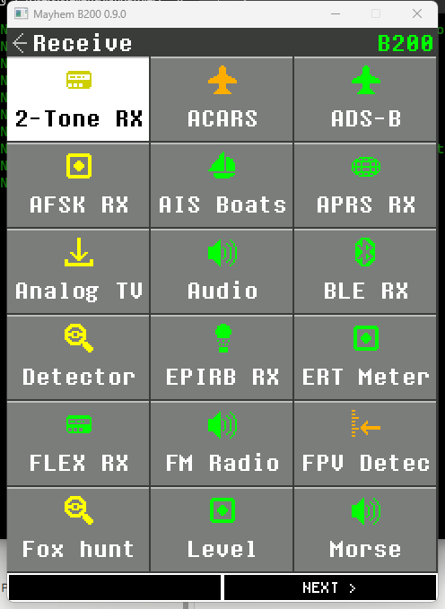
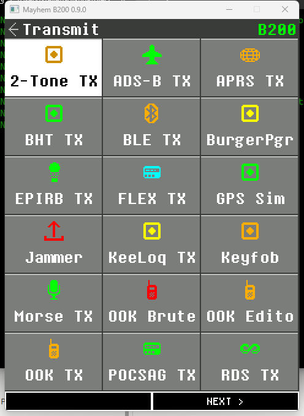
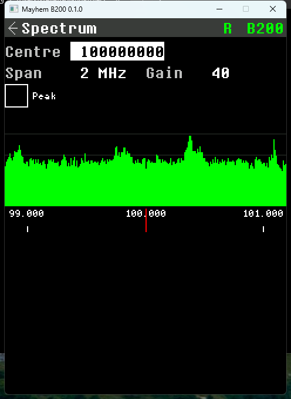
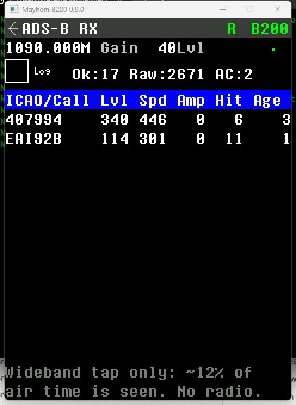
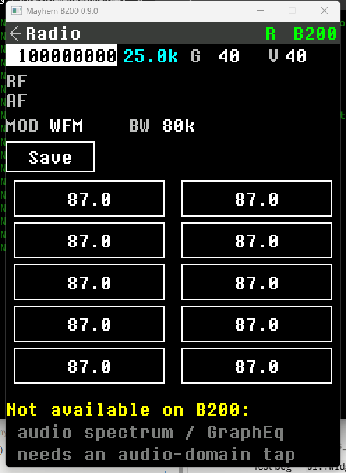

# Mayhem B200

PortaPack Mayhem's interface and its whole app suite, running on your PC against
an **Ettus USRP B200** — with more bandwidth, better filters and a real CPU
behind it.

    

> **Tested on real hardware.** Run against a physical **Ettus USRP B200**
> (serial EDR04ZDB2, 2026-08-03): all 67 radio apps run on the device, the
> backend self-test passes across 100 MHz – 2.44 GHz with zero dropped samples,
> and the ADS-B app decoded real aircraft off the air. Details in
> [Status and caveats](#status-and-caveats).

> **This project is looking for people.** It works, it decoded real aircraft off
> the air, and it is one person's work so far. If you want a portable version of
> this to exist, or you design PCBs, or you just want to try it — see
> [Where this goes next](#where-this-goes-next) and
> [How you can help](#how-you-can-help). Telling me you want it is genuinely
> useful; a star on this repo is the cheapest way to do that.

---

## Screenshots

All captured from the running application with the **Ettus USRP B200 connected**
(the green `B200` in the status bar). Mayhem's own fonts, palette and 240×320
layout, drawn to a host framebuffer.

|  |  |  |
|:---:|:---:|:---:|
| **Home** — the icon-grid menu | **Receive** — 33 RX apps (one of several pages) | **Transmit** — 26 TX apps |
|  |  |  |
| **Spectrum** — live FM band off the B200 | **ADS-B** — real aircraft decoded off the air (17 valid frames) | **FM Radio** — WFM broadcast receiver |

---

## Download

**[Download the latest Windows build →](https://github.com/wonderingStars/mayhem-b200/releases/latest)**

Grab the `mayhem-b200-<version>-win64.zip`, unzip it anywhere, and run
`mayhem-b200.exe`. It is self-contained — the UHD and Visual C++ runtime DLLs
and the B200/B210 firmware/FPGA images are bundled, so **no separate UHD, Boost
or Visual Studio install is needed.**

There is **one** manual step, once per PC: bind the **WinUSB** driver to the
B200 with [Zadig](https://zadig.akeo.ie) (every USRP needs this on Windows).
Full instructions are in `READ-ME-FIRST.txt` inside the zip. After that, plug in
the B200 and the status bar shows a green **B200**.

Prefer to build it yourself? See [Building](#building).

---

## What this actually is

Mayhem is firmware. It runs on the PortaPack's LPC43xx — a dual-core Cortex-M
with a 240x320 LCD, a five-way switch and an SD card — and it drives a HackRF
One over an SGPIO bus.

**A USRP B200 has none of that.** It is a USB peripheral: a Spartan-6 FPGA, a
Cypress FX3 USB controller and an AD9364 transceiver. There is no application
processor to run firmware on, no screen, and no buttons. You cannot flash
Mayhem onto a B200, and anything claiming to do so is claiming something the
hardware cannot do.

So this is the other half of the idea: Mayhem's *UI and apps*, rebuilt as a host
application, with UHD and the B200 standing in for the SGPIO bus and the
HackRF's front end. The window is a real 240x320 framebuffer drawn with Mayhem's
own fonts, palette and widget layout; your keyboard and mouse are the five-way
switch, the encoder and the touch panel.

The parts of Mayhem that were hardware-independent — geometry, fonts, painter,
focus manager, theme, the spectrum palette — are used unchanged. See
[NOTICE.md](NOTICE.md) for exactly which files, and what was modified.

### What you gain over a PortaPack

- **Up to 56 MHz of instantaneous bandwidth** instead of the HackRF's 20 MHz,
  so the spectrum app shows a live wide span rather than a swept one.
- **A real CPU for the DSP**, so the channel filters are designed at run time
  for whatever sample rate you pick instead of being fixed tap tables.
- **LO offset tuning**, which moves the direct-conversion LO spike out of the
  displayed band — the PortaPack has the same artefact and no way to avoid it.
- **Capture while listening.** Recording taps the same samples the demodulator
  is already using, so IQ recording is not an exclusive mode.

### What you lose

It is not pocket-sized and it needs a host. That is what the next section is
about.

---

## Where this goes next

The obvious question is whether this can become a handheld again. It can, but
not the way a PortaPack does, and it is worth being precise about why.

A PortaPack works because the HackRF already contains the computer. The
PortaPack is a screen, a control wheel and an audio codec on a header, and the
HackRF's own MCU runs Mayhem. **A B200 mini has no such processor** — it is a
USB device and it needs a USB host. So a portable build is not a PortaPack; it
is a small computer, a B200 mini and a battery in one enclosure, running this
software.

That makes the concept roughly:

| Part | Why |
|---|---|
| SBC with real USB 3 | The B200's high sample rates need it; USB 2 caps you near 16 Msps |
| B200 mini (or clone) | The radio |
| 240x320-and-up display | The UI is drawn at PortaPack resolution and scales cleanly |
| Five-way + encoder + audio | So the existing input mapping just works |
| Battery and power path | Radio plus host is watts, not milliwatts — this is the hard part |
| Carrier PCB | Ties the above together instead of a nest of adapters |

**Two things have to happen before the PCB is the interesting problem:**

1. **~~A Linux port.~~ Done.** The display is X11 and the audio is ALSA on
   Linux, Win32/GDI and WinMM on Windows, selected by CMake. It builds and
   passes the same 2154 tests on both. The platform-specific code stayed
   contained to three files out of ~108k lines, because everything above them
   is Mayhem's own portable UI core. Caveat worth stating: the ALSA path has
   not yet played audio on real hardware — it was developed under WSL, which
   has no sound device — so that is the first thing to check on an SBC.
2. **Evidence that people want it.** A carrier board costs money and somebody's
   evenings. Before that, the same machine can be built from off-the-shelf
   parts and adapters — ugly, but it proves the idea and it costs the project
   nothing. If a handful of people build one, the PCB is worth designing.

That is the honest order of operations. I would rather say so than take money
for a board nobody has run the software on.

---

## How you can help

**I am one person and this needs more than one.** In rough order of how much it
would unblock:

- **Try it and say something.** Open an
  [issue](https://github.com/wonderingStars/mayhem-b200/issues) — "this worked",
  "this decoded nothing", "I would buy the portable one" are all useful. Star
  the repo if you want it to continue; that number is the only signal I have.
- **Testing the Linux build on real hardware.** It builds and passes the suite,
  and the window and input are verified, but two things have never run outside
  a WSL container: ALSA audio (no sound device there) and a USB SDR (no
  passthrough). If you have a Linux box and any supported radio, that is the
  single highest-leverage thing you can report.
- **A DRM/KMS or Wayland display backend.** X11 works; a framebuffer-direct
  path would suit an SBC with no desktop better.
- **A PCB designer.** If the handheld gets past the proof stage I need someone
  who has done power paths and USB 3 layout properly. Talk to me before it is
  urgent — the enclosure and the board argue with each other early.
- **RF testing.** Almost every decoder here is unit-tested but has never met a
  real signal (see [Status](#status-and-caveats)). If you have a POCSAG pager,
  an AIS receiver's view of a harbour, a weather sonde overhead — running one
  app and reporting what happened is real work I cannot do alone.
- **Transmit verification**, if you are licensed and have a dummy load. Nothing
  in the TX chain has ever radiated.

**Funding.** There is no donation link yet and I am not going to put one up to
collect money for a product that does not exist. If the interest is there it
will go here, and it will be for parts and prototype boards, itemised. If you
want to fund something specific in the meantime, say so in an issue.

---

## Requirements

| | |
|---|---|
| Hardware | Ettus USRP B200 (B210, B200mini and B205mini should also work — every limit is read from the device, not hard-coded). Any other SDR via [sdrlink](https://github.com/wonderingStars/sdrlink-beta) — see `--driver=sdrlink` below |
| OS | Windows 10/11 x64, or Linux x64 |
| Compiler | MSVC 2022 (Build Tools are enough), or GCC 12+ |
| UHD | 4.x with headers — the stock Windows installer, or `libuhd-dev` |
| Boost | headers only; UHD's public headers include `<boost/format.hpp>` |
| CMake | 3.20+ |
| Linux only | X11 (`libx11-dev`) and ALSA (`libasound2-dev`) |

No other dependencies. The window is plain Win32/GDI on Windows and plain X11
on Linux; audio is WinMM and ALSA respectively. There is no SDL, Qt or FFTW to
install.

## Building

### Linux

```bash
sudo apt install build-essential cmake libx11-dev libasound2-dev libuhd-dev
cmake -S . -B build -DCMAKE_BUILD_TYPE=Release
cmake --build build -j$(nproc)
./build/tests/mb200_tests
```

Builds and passes the full suite on Linux.

A prebuilt Linux x64 binary is attached to the
[release](https://github.com/wonderingStars/mayhem-b200/releases), but it
needs **glibc 2.43 (Ubuntu 26.04 and nothing older)**, because that is the
only Linux available to build it on. On 24.04 LTS or anything else, build from
source with the two commands above — the binary is tied to the glibc of the
machine that built it, so copying it between distributions does not work.

### Windows

```bash
cmake -S . -B build -G Ninja -DCMAKE_BUILD_TYPE=Release
```

If UHD or Boost are not in the default locations, point at them:

```bash
cmake -S . -B build -G Ninja -DUHD_ROOT="C:/Program Files/UHD" -DBOOST_INCLUDE_DIR="C:/vcpkg/installed/x64-windows/include"
```

Then build and test:

```bash
cmake --build build
```

```bash
ctest --test-dir build --output-on-failure
```

`uhd.dll` is copied next to the binary automatically, so the build tree runs
as-is.

## Running

```bash
build\mayhem-b200.exe
```

| Option | Meaning |
|---|---|
| `--driver=<uhd\|sdrlink>` | Radio backend. `uhd` talks to a local USRP; `sdrlink` talks to an [sdrlink](https://github.com/wonderingStars/sdrlink-beta) server, which is how you use any non-USRP radio |
| `--args=<backend args>` | For `uhd`, a device address such as `type=b200,serial=31C9297`. For `sdrlink`, `host[:port]`, optionally `/` and remote device args |
| `--scale=<1..6>` | Window magnification (default 2) |
| `--portal[=port]` | Serve the browser UI and JSON API (default 8090) |
| `--list` | List attached USRPs and exit (uhd only) |
| `--help` | Usage |

To drive a radio that is not a USRP — RTL-SDR, HackRF, Airspy, LimeSDR,
PlutoSDR — run an sdrlink server beside it and point this at it:

```bash
mayhem-b200 --driver=sdrlink --args=127.0.0.1:5960/driver=rtlsdr
```

The app starts and stays usable with no radio attached — it shows `no dev` in
the status bar, and **Radio setup → Reconnect** picks the device up when you
plug it in. **You do not need a B200 to look around**, which is the easiest way
to decide whether you care about this project.

### Controls

| Input | PortaPack equivalent |
|---|---|
| Arrow keys | five-way switch |
| Enter / Space | Select |
| Escape / Backspace | Back |
| Mouse wheel | rotary encoder |
| PageUp / PageDown | encoder, one detent |
| Left mouse button | touch panel |
| F11 | cycle window scale |

In the audio app, Left/Right tune by the current step no matter which control
has focus. Select on the frequency field cycles the step size
(1 Hz through 1 MHz, including 6.25 / 12.5 / 25 kHz).

## Apps

The full PortaPack Mayhem app suite is ported — **~103 apps** across the same
category menus Mayhem uses, all reachable from the icon-grid home screen:

- **Receive (33):** Audio (AM/NFM/WFM/SSB/CW), ADS-B, AIS, APRS, POCSAG, FLEX,
  Radiosonde, Weather/TPMS, ERT, ACARS, AFSK, RTTY, SSTV, Morse, NOAA APT, WeFax,
  VOR, Scanner, Signal Hunter, Detector, Level, Time Sink, FM Radio, Tetra,
  SubCar, 2-Tone, NRF, EPIRB, FPV Detect, Analog TV, gfxEQ, Fox hunt.
- **Transmit (26):** Mic, OOK/Encoders + OOK Editor/Brute, RDS, APRS, RTTY, Morse,
  POCSAG, FLEX, SSTV, Signal gen, 2-Tone pager, Soundboard, GPS Sim, VOR, ADS-B,
  EPIRB, Jammer, KeeLoq, Keyfob, Security+, BHT, BurgerPgr, BLE, cart lock.
- **Transceiver (2):** Mic TX, KISS TNC.
- **Utilities (17):** Capture IQ, Replay/Playlist, Playlist Editor, File Manager,
  Freq Manager, Notepad, IQ Trim, Calculator, Antenna Length, Metronome, Stopwatch,
  Tuner, Random Password, WAV Viewer, Waterfall Designer, Wardrive Map.
- **Games (10):** Snake, Tetris, 2048, Breakout, Space Invaders, Blackjack,
  Battleship, Dino, Morse Practice, DOOM (shell).
- **Settings / Debug:** Radio Setup, Settings, About, Hard Reset, Audio Test,
  Font Viewer, Debug PMem, plus honest **"N/A on B200"** screens for the
  PortaPack-only apps (MCU Temperature, Ext Sensors, SD-over-USB, Wipe SD card,
  App Manager) that explain why the hardware does not apply.

Every app with decode/encode logic is tested against known protocol data (CRC
vectors, round-trips through the modulators, documented frames). TX apps that
radiate illegal signals (jammer, GPS sim, ADS-B/EPIRB TX, spam family) carry an
on-screen legality warning and never transmit without an explicit action.

Recordings and frequency lists go under
`Documents\mayhem-b200\CAPTURES` and `...\FREQMAN`.

### Depth caveats

DOOM is a shell that reports whether a WAD is present, not a playable port.
Analog TV and some wideband 2.4/5.8 GHz apps (BLE, NRF, FPV) sit at the edge of
the B200's range and their pipelines are ported and unit-tested but, like
everything here, unproven on real RF (see Status).

## How it fits together

```
             UHD  ──►  UsrpRadio  ──►  lock-free ring  ──►  ReceiverModel
                       (streaming                            (NCO → channel FIR
                        threads)                               → demod → audio
                                                                filter → de-emph
                                                                → AGC → resample)
                                                                      │
                            ┌─────────────────────────────────────────┤
                            ▼                                         ▼
                       waveOut                                  spectrum tap
                                                                      │
   Win32 window ◄── framebuffer ◄── Painter ◄── widget tree ◄── FFT ───┘
   (keyboard/mouse)   240x320       (Mayhem)     (Mayhem)
```

- `src/ui` — Mayhem's UI core plus the host display, window and input
- `src/dsp` — filters, FFT, demodulators, resampling, ring buffers
- `src/radio` — the UHD backend and the receive chain
- `src/audio` — WinMM output and capture
- `src/apps` — navigation and the app views
- `src/core` — string formatting, paths

The DSP is not a copy of Mayhem's fixed-point M4 code; it is float, and the
filters are designed at run time so they track the sample rate. The modes and
their bandwidths deliberately match Mayhem's labels.

## Tests

**1986 tests, no framework dependency:**

```bash
build\tests\mb200_tests.exe
```

They cover the string formatting (locked to the firmware's exact output,
including its slightly surprising `-0042` sign padding), the DSP against
analytically-known results (FM deviation scaling, SSB opposite-sideband
rejection, FFT bin placement, resampling ratios, squelch hysteresis), the
display's scroll-region arithmetic, widget behaviour, and every no-device path
in the radio layer.

## Status and caveats

**The receive path is verified on a physical USRP B200** (serial EDR04ZDB2,
2026-08-03). A hardware self-test (`tools/hw_selftest.cpp`, build target
`mb200_hwtest`) opens the device, reads its capabilities (42 MHz – 6.008 GHz,
0–76 dB, up to 16 Msps on USB 2), sweeps gain (−69 → −15 dBFS across 0–60 dB),
tunes and streams at eight frequencies from 100 MHz to 2.44 GHz, and sustains
2.40 Msps for 2 s with **zero overflows, drops or errors** — all checks pass.
The GUI has been driven live: the spectrum shows the real FM broadcast band, and
the **ADS-B app decoded real aircraft** off the air (17 CRC-valid Mode S frames,
2 aircraft, real ICAO/callsign/speed), which exercises the full
tune → stream → demod → CRC → parse chain on live RF.

What is **still unverified on hardware:**
- **Transmit.** Nothing has been transmitted. The TX chain and encoders are
  unit-tested only.
- **Most individual decoders** beyond ADS-B — their logic is unit-tested against
  known data, but a live decode depends on a signal being present locally.
- **USB 3 rates.** The test device was on a USB 2 port (16 Msps ceiling); wide
  spans and high sample rates are untested.
- Audio demodulation was confirmed to *stream and measure* correctly but not
  verified by ear.

The UI, DSP and file handling are exercised directly by the unit tests (1986,
all passing) and by running the application.

## Licence

GPL-2.0-or-later, inherited from PortaPack Mayhem. See [NOTICE.md](NOTICE.md)
for attribution and [LICENSE.GPL-2.0-or-later](LICENSE.GPL-2.0-or-later) for
terms. No warranty.

This is an independent project. It is not affiliated with or endorsed by the
PortaPack Mayhem project, or with Ettus Research / NI. Any hardware that comes
out of it ships under the same licence, source included.

You are responsible for what you transmit. Most of the B200's tuning range is
licensed to somebody.
